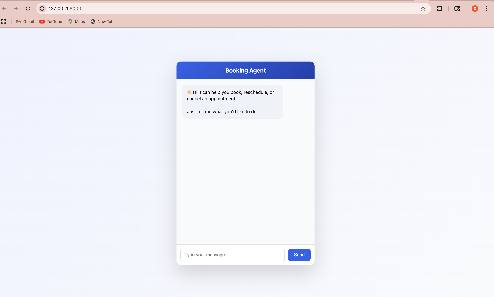
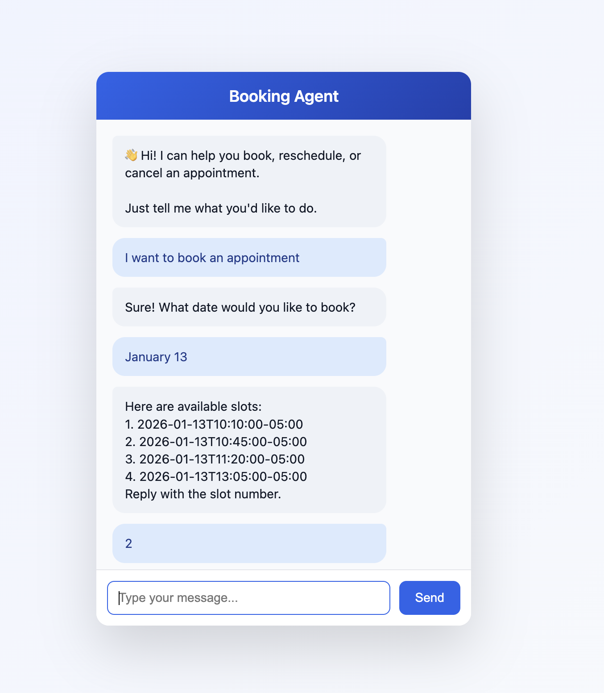
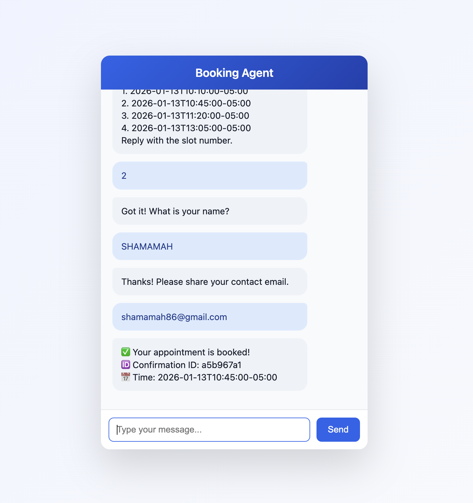
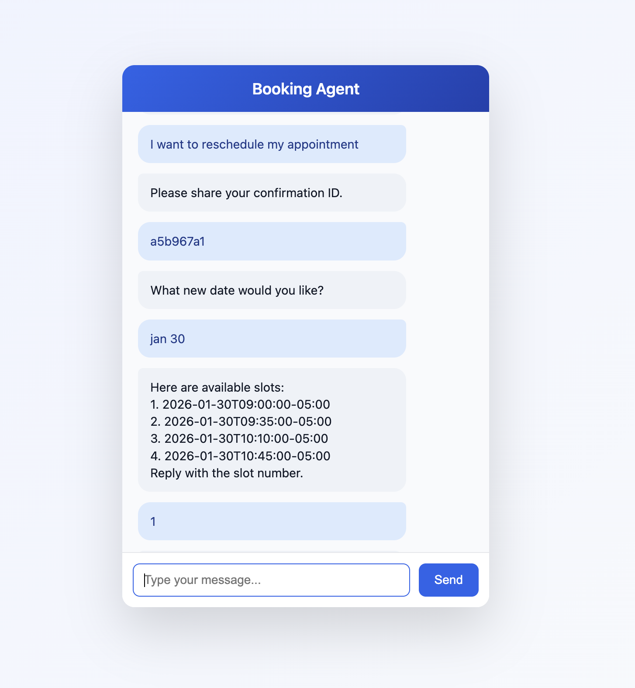
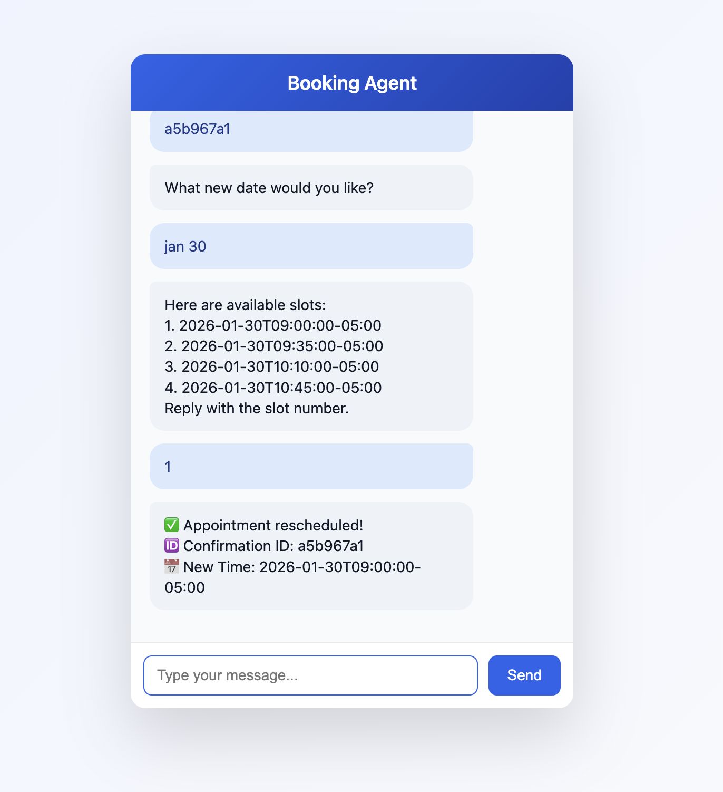
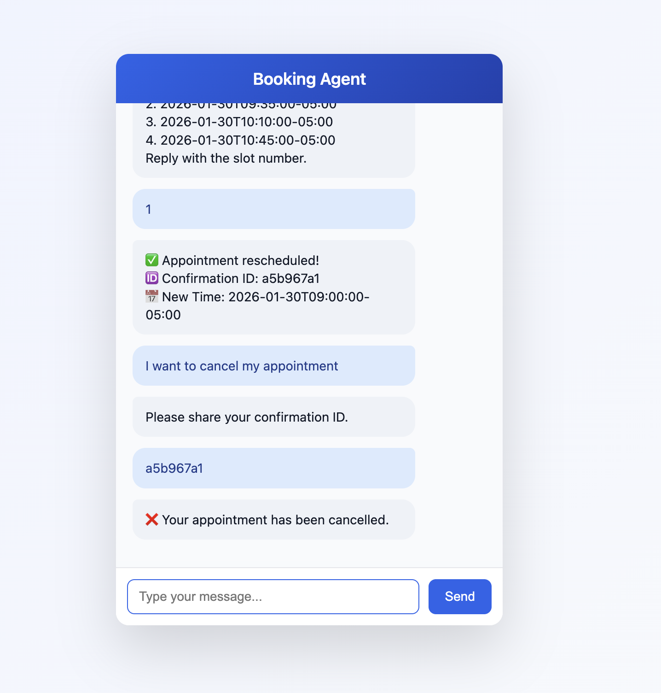

# 🗓️ Booking Agent – Conversational Appointment Scheduler

A simple, rule-based conversational **Booking Agent** that allows users to **book, reschedule, or cancel appointments** through a clean chat UI.

Built with **FastAPI + Vanilla JavaScript**, this project demonstrates end-to-end agent behavior with session memory, deterministic logic, and a polished frontend.

---

## ✨ Features

* 💬 Conversational chat interface
* 📅 Book appointments with slot suggestions
* 🔁 Reschedule existing appointments using Confirmation ID
* ❌ Cancel appointments using Confirmation ID
* 🧠 Session-based conversation memory (in-memory)
* 🎨 Polished, modern chat UI
* ⚡ FastAPI backend with Swagger docs

---

## 🖼️ Application Screenshots

### 💬 Chat Interface


### 📅 Booking an Appointment


### ✅ Booking Confirmation


### 🔁 Reschedule Appointment



### ❌ Cancel Appointment


---

## 🧱 Tech Stack

**Backend**

* Python
* FastAPI
* Uvicorn
* dateutil

**Frontend**

* HTML
* CSS
* Vanilla JavaScript (no frameworks)

---

## 📂 Project Structure

```
booking-agent/
│
├── backend/
│   ├── main.py              # FastAPI app entry point
│   ├── chatagent.py         # Conversational booking logic
│   ├── agent.py             # Slot suggestion & booking helpers
│   ├── db.py                # In-memory appointment storage
│   ├── rules.py             # Simple intent rules
│   └── static/
│       ├── index.html       # Chat UI
│       ├── style.css        # UI styling
│       └── app.js           # Frontend logic
│
├── requirements.txt
└── README.md
```

---

## 🚀 How to Run Locally

### 1️⃣ Create virtual environment

```bash
python -m venv .venv
source .venv/bin/activate   # macOS / Linux
# .venv\Scripts\activate    # Windows
```

### 2️⃣ Install dependencies

```bash
pip install -r requirements.txt
```

### 3️⃣ Start the server

```bash
uvicorn main:app --reload
```

### 4️⃣ Open in browser

```text
http://127.0.0.1:8000
```

Swagger API Docs:

```text
http://127.0.0.1:8000/docs
```

---

## 🧠 How the Agent Works

The agent uses **deterministic rule-based logic** with session state:

1. Detects user intent (book / reschedule / cancel)
2. Collects required information step-by-step
3. Suggests available slots
4. Confirms booking and generates a Confirmation ID
5. Uses Confirmation ID for rescheduling or cancellation

No LLMs. No hallucinations. Fully predictable behavior.

---

## 💬 Example Conversation

```
User: I want to book an appointment
Bot: What date would you like to book?

User: 13 Jan
Bot: Here are available slots...
     1. 10:10
     2. 10:45
     3. 11:20
     4. 11:55

User: 3
Bot: What is your name?

User: Shamamah
Bot: Please share your contact email.

User: shamamah@example.com
Bot: ✅ Your appointment is booked!
     🆔 Confirmation ID: f66282ae
```

---

## 🎯 Why This Project

* Demonstrates **agentic thinking without LLMs**
* Clean separation of UI and logic
* Great foundation for:

  * AI agents
  * Chat-based workflows
  * Scheduling systems
  * RAG / LLM upgrades later

---

## 🔮 Future Improvements

* Persistent database (SQLite / PostgreSQL)
* Authenticated sessions
* Calendar integration
* LLM-powered intent detection
* Button-based quick actions
* Deployment (Render / Railway / Vercel)

---

## 👩‍💻 Author

Built by **Shamamah Firdous**
Master’s Student | AI & Intelligent Systems

---

⭐ If you like this project, give it a star!
